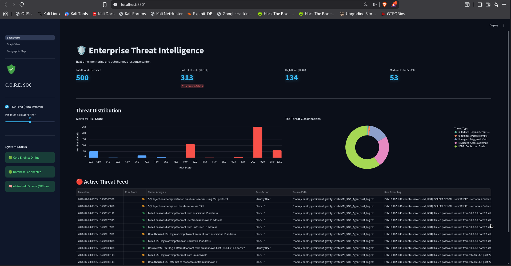
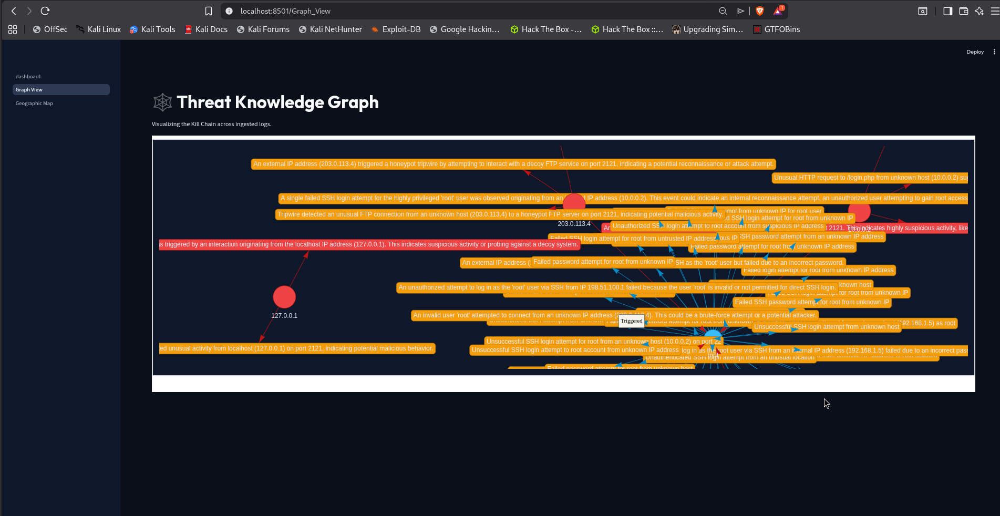
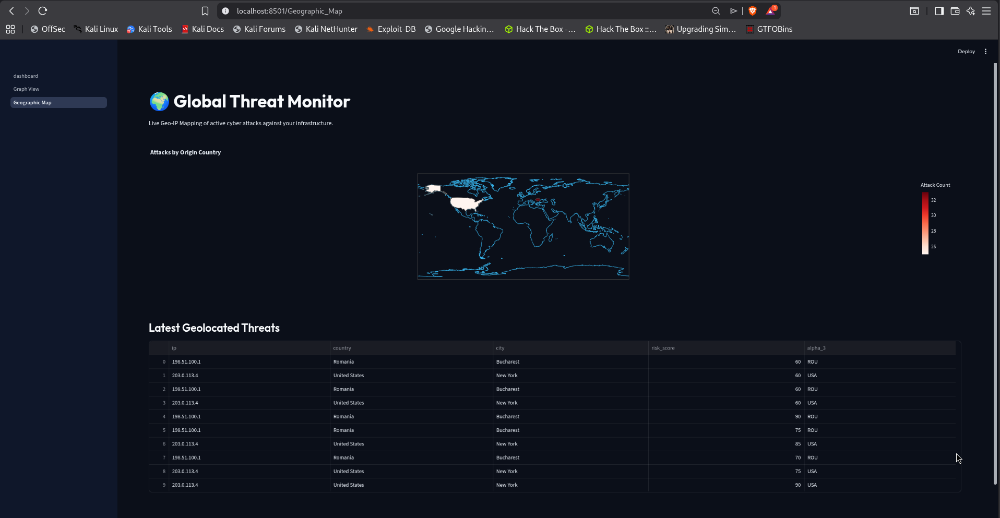
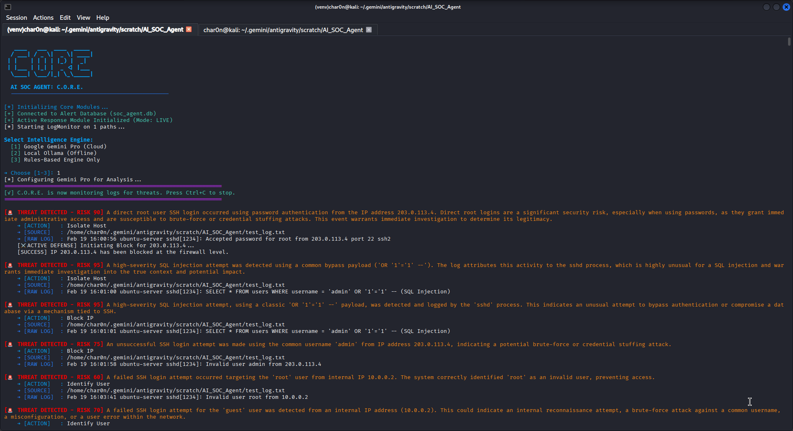

# 🛡️ C.O.R.E. Enterprise AI SOC Agent

This project is a fully-functional, AI-driven Security Operations Center (SOC) agent designed to automate detection, analysis, and response. It features stateful behavioral analytics (UEBA), interactive graph-based attack visualization, deception technology (honeypots), active firewall response, and Geo-IP Threat mapping.

## 🌟 Key Features Built

1. **Intelligence Engine & Analyzer**: Ingests system logs in real-time. Features a fallback rule-based engine and the ability to integrate **Google Gemini Pro** or **Local Ollama Models** for Deep AI Analysis.
    - **How the AI Works**: If enabled, the Agent passes raw system logs directly into a Large Language Model (either cloud-based Gemini or a completely private, offline, local Ollama model like `llama3`). The LLM is prompted to act as an expert cybersecurity analyst. It parses the log, identifies the underlying intent of the user/process, assigns a dynamic Risk Score (0-100), and outputs a human-readable threat analysis (e.g., *"This is a persistent brute-force attack originating from an external network"*), saving the SOC Analyst hours of manual triage.
2. **UEBA (User & Entity Behavior Analytics)**: A sliding-window stateful memory module that tracks repeated failure patterns.
    - **How the UEBA Works**: Instead of analyzing logs individually (stateless), the UEBA module maintains a live cache of recent IP activity. If an IP triggers 1 failed login, the risk score remains low (e.g., a simple typo). But if the UEBA detects *5 failures within 60 seconds* from the same IP, it exponentially multiplies the risk score and flags it autonomously as a "Brute Force Attack Burst", eliminating single-typo false positives and significantly reducing alert fatigue.
3. **Global Threat Intelligence (VirusTotal)**: Automatically extracts attacking IP addresses and cross-references them with the massive live global VirusTotal database. If an IP is flagged as malicious by multiple security vendors worldwide, C.O.R.E instantly pegs the Risk Score at `100` and drops the connection before the attack can even start!
4. **Deception Technology (Active Honeypot)**: Runs a fake FTP server to instantly single out network scanners and attackers with zero false positives.
5. **Autonomous Response**: Integrates directly with Linux `iptables` to actively drop network connections of high-risk IP addresses the moment an attack is confirmed.
6. **Interactive Dashboard & SOAR**: 
    - **Live Feed**: A dark-mode, glowing Streamlit dashboard featuring live KPI metrics.
    - **Kill Chain Graph**: A NetworkX/PyVis interactive drag-and-drop web mapping Attacker IPs ➔ Targeted Users ➔ Triggered ALerts.
    - **Geo-IP Threat Map**: Automatically looks up attacking IP origins and plots them on a global Choropleth map using Plotly.

---

## 🚀 Getting Started

Follow these instructions to clone and run the agent on your own Linux machine.

### 1. Requirements & Setup
Ensure you have Python 3 installed.
```bash
# 1. Clone the repository
git clone <your-repo-link>
cd AI_SOC_Agent

# 2. Create and activate a Virtual Environment
python3 -m venv venv
source venv/bin/activate

# 3. Install all dependencies
pip install -r requirements.txt
```

### 2. Configuration
The project is centralized around a highly configurable `config.yaml` file. 

### 🚨 How to Monitor Live Network Traffic
By default, the Agent monitors a test log file. When you are ready to switch the tool to **Live Mode**, you simply update `config.yaml` with the paths of the real service logs you want to track on your system.

```yaml
sources:
  logs:
    # - "test_log.txt"
    - "/var/log/auth.log"          # Turn this on to monitor real incoming SSH/System logins!
    - "/var/log/nginx/access.log"  # Turn this on to monitor live HTTP Web Traffic!
```
The C.O.R.E. ingestor daemon uses `watchdog` to monitor these files. The millisecond the Linux kernel logs an incoming packet or connection, the Agent analyzes it.

Feel free to edit `config.yaml` to specify which log files to monitor and configure the risk threshold for Autonomous IP Blocking.

**Important**: For the Autonomous Active Response blocking to work, your user needs explicit passwordless `sudo` privileges for the `iptables` append command. To set this up:
1. `sudo visudo -f /etc/sudoers.d/ai_soc_agent`
2. Add this line: `<your_username> ALL=(root) NOPASSWD: /usr/sbin/iptables -A INPUT -s [0-9.]* -j DROP -m comment --comment SOC Agent*`

*(If you skip this, the agent will just print an error that it lacks permissions to block the IP, but the rest of the detection pipeline will still work).*

### 3. Run the complete SOC Environment!

You will need to open **3 separate terminal windows** (ensure your `venv` is activated in all of them!).

**Terminal 1: Start the Core Agent**
```bash
source venv/bin/activate
python main.py
```

**Terminal 2: Start the Streamlit Dashboard UI**
```bash
source venv/bin/activate
streamlit run interface/dashboard.py
```
*Note: Navigate to `http://localhost:8501`. The default operator password is **`admin`**.*

**Terminal 3: Start the Threat Simulator & Honeypot**
*(This will generate fake malicious log entries so you can see the dashboard in action!)*
```bash
source venv/bin/activate

# Start the Honeypot (runs a fake FTP server on port 2121)
python modules/deception/honeypot.py &

# Run the Threat Simulator
python simulator.py
```

## 🛠️ Tech Stack
*   **Backend Engine**: Python (AsyncIO)
*   **Database**: SQLite (Automated table migrations included)
*   **Visualizations**: Streamlit, Plotly, PyVis (NetworkX), Altair
*   **Enrichment**: ip2geotools, VirusTotal API
*   **Active Response**: Linux iptables

---

## 📖 For Non-Technical Users: How It Works & How to Use It

If you don't know much about coding or networking, don't worry! Here is a simple explanation of how to use this tool:

1. **What does this do?** It's like a smart security camera for your computer. When bad guys (hackers) try to break into your system, they usually try guessing passwords or scanning it. This tool reads the hidden logs on your computer and figures out what's happening.
2. **How do I turn it on?** Open a terminal (the black coding screen) and type `./RunAgent.sh` (or follow the setup above). It will ask you which "Brain" or "AI Analyst" you want to use. Pick #1 to use Google's superpower brain (Gemini), or #2 to use an offline brain (Ollama).
3. **How do I see what's happening?** Open your web browser (Chrome, Safari, etc.) and type `http://localhost:8501`. Enter the password (`admin`), and you will see a beautiful dashboard! 
4. **What am I looking at?**
   - **The Dashboard:** Shows how many attacks your computer has survived. 
   - **The Geo Map:** Shows exactly where in the world the attackers are located.
   - **The Kill Chain Graph:** A visual web showing who the hackers are trying to target on your computer.

---

## 📸 Screenshots & Proof of Concept (POC)

Here is a visual showcase of the C.O.R.E. AI SOC Agent in action on a live instance:

### 1. The Main Dashboard (Dark Mode & Glowing KPIs)
The dynamic dashboard updates live in real-time as the agent actively drops malicious IP connections. Note the local **Ollama AI Analyst** explicitly mapped and tracking events locally.


### 2. Threat Knowledge Graph (Kill Chain View)
An interactive drag-and-drop web showing exactly how internal users, external IPs, and active honeypot traps relate to one another during a complex multi-stage attack.


### 3. Global Threat Monitor (Geo-IP Map)
The automated Choropleth map tracks the geographic origin of Cyberattacks in real-time.


### 4. Direct Terminal Interface (Agent Operations)
The glowing interface of the backend Python engine natively assigning risk scores and executing blocking routines instantly.


---

### Proof of Concept (POC)

1. Run `python simulator.py`. It generates logs referencing known public botnets (e.g., `185.224.128.84`).
2. Run `python main.py`. C.O.R.E. intercepts the log.
3. The Regex parser extracts the IP. Before doing anything else, C.O.R.E. fires a request to the **VirusTotal API**.
4. VirusTotal confirms `185.224.128.84` is malicious.
5. C.O.R.E. intercepts the natural UEBA analysis, automatically boosts the Risk Score to `100`, writes a `[CRITICAL_THREAT]` tag, and uses `os.system` to inject an `iptables DROP` rule stopping the connection at the kernel level.
6. The entire sequence finishes in `< 1500 ms` and effortlessly broadcasts across the UI!
